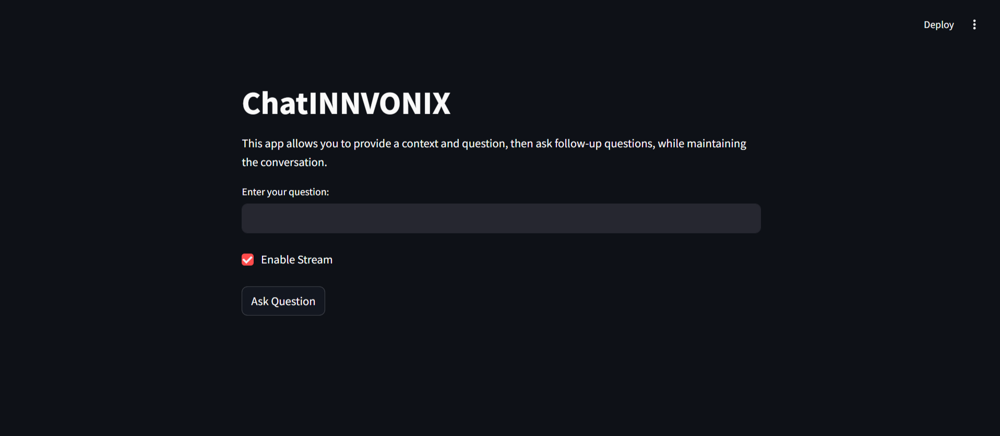

# RAG-Based Chatbot POC Powered by DeepInfra (Llama 3-70B)

## Project Overview

This project demonstrates a Retrieval-Augmented Generation (RAG) architecture for a chatbot, deployed as a quick Proof of Concept (POC) using **DeepInfra**, **PostgreSQL**, and **Streamlit**. It leverages **Llama 3-70B** for generating context-aware responses and implements a seamless user interface for interaction.

---

---

## Key Features

1. **DeepInfra API**: 
   - Utilizes the Llama 3 API provided by DeepInfra, leveraging its free credits for testing and evaluation.
   - Powers context-aware, high-quality natural language responses.

2. **PostgreSQL for Vector Storage**:
   - Stores vector embeddings of the context documents.
   - Enables similarity-based retrieval of relevant information using embeddings.

3. **Streamlit UI**:
   - A lightweight, user-friendly web interface for chatbot interaction.
   - Facilitates smooth question-and-answer exchanges with follow-up query support.

---

## Workflow

1. **Embedding Creation**:
   - Contextual data is embedded using a vectorization model and stored in the PostgreSQL database.

2. **Query Processing**:
   - When a user inputs a query, the system retrieves relevant documents from the database using a similarity search.

3. **Response Generation**:
   - The retrieved documents and user query are combined to create a prompt.
   - This prompt is sent to Llama 3 via the DeepInfra API to generate an accurate, context-aware response.

4. **Follow-Up Interaction**:
   - The chatbot maintains the context of previous interactions, allowing users to ask follow-up questions seamlessly.

---

## Technologies Used

- **DeepInfra**: Provides access to Llama 3-70B API for text generation.
- **PostgreSQL**: Used for storing vector embeddings and enabling efficient similarity-based context retrieval.
- **Streamlit**: Deploys a fast and intuitive UI for the chatbot.

---

## Use Cases

- Rapid prototyping of AI chatbots with contextual awareness.
- Demonstrating the capabilities of RAG architecture.
- Testing DeepInfra’s Llama API for interactive and intelligent response generation.

---

This setup is ideal for quick prototyping and exploring the effectiveness of RAG-based chatbots in real-world applications.
